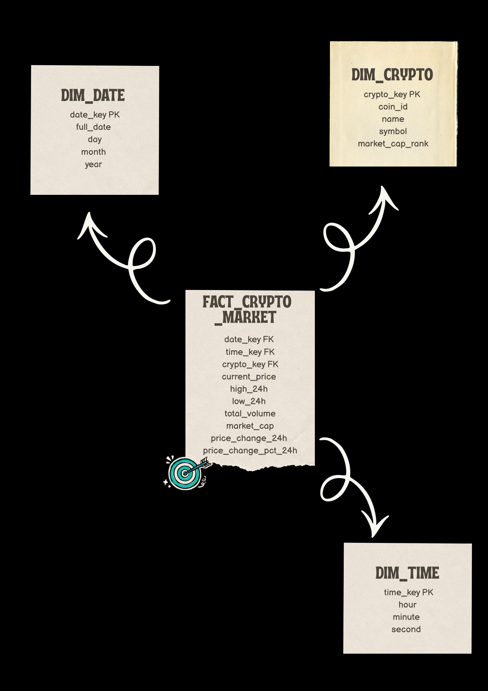
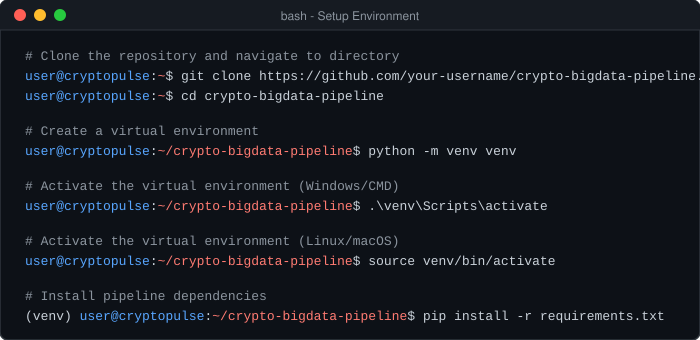
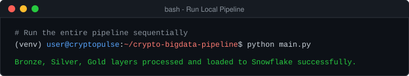
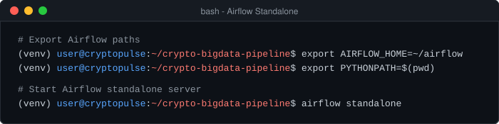

<div align="center">


<br><br>

<h1 align="center">CRYPTOPULSE BIG DATA PIPELINE</h1>


<br><br>


<br><br>

<p align="center">
A modern, production-grade Big Data pipeline designed to ingest, process, structure, and analyze live cryptocurrency market data from the CoinGecko API. Combining the Medallion architecture inside a MinIO Data Lake, analytical processing using Pandas, dimensional modeling in Snowflake, and orchestration via Apache Airflow.
</p>

</div>

<br>

<div align="left">


</div>

<br>

**CryptoPulse** is an end-to-end Data Engineering & Business Intelligence project focused on the cryptocurrency market. 

By leveraging the power of modern cloud-data tools, this system collects real-time crypto prices, trading volumes, and market capitalizations, transforming raw data into structured insights. The pipeline automates the entire flow:
*   **Data Ingestion:** Reliable daily pulls from the CoinGecko API.
*   **Data Lake (MinIO):** A 3-layer Medallion Lakehouse structure (Bronze ➔ Silver ➔ Gold).
*   **Dimensional Modeling:** Custom Star Schema designed for advanced OLAP analytics.
*   **Data Warehousing:** Loading high-fidelity dimensional models into Snowflake.
*   **Orchestration:** Complete workflow automation and error-handling using Apache Airflow.
*   **Analytics & BI:** Interactive executive dashboards using Tableau Desktop.

<br>

<div align="left">


</div>

<br>

The pipeline follows a clear and robust lineage, moving data through ingestion, cleaning, structuring, loading, and visualization.

<div align="center">
<p align="center">

</p>
</div>

<br>

<div align="left">


</div>

<br>

The data warehouse uses a **Star Schema** designed to optimize analytical queries, fast aggregations, and seamless integration with Tableau.

<div align="center">
<p align="center">

</p>
</div>

### Schema Benefits:
*   **Fast OLAP Queries:** Optimized for complex aggregations (averages, rankings, time-series growth).
*   **Referential Integrity:** Strong constraints (PK/FK) to guarantee clean data lineage.
*   **Simplified Tableau Joins:** Clear separation of dimensions and facts, preventing duplicate measures.
*   **High Scalability:** Seamless addition of new dimensions or metrics without breaking backward compatibility.

---

<br>

<div align="left">


</div>

### 1. Ingestion Layer (Bronze)
Raw JSON payloads fetched daily from the CoinGecko API are saved as-is, preserving historical data for re-runs.
*   **Path:** `crypto-bronze/YYYY/MM/DD/raw.json`
*   **Features:** Handles API timeouts, network connection retries, and rate limit errors.

### 2. Cleaning & Standardization Layer (Silver)
The raw dataset is normalized and cleaned using Pandas, then converted to an optimized columnar format.
*   **Path:** `crypto-silver/YYYY/MM/DD/market_data.parquet`
*   **Tasks:** Column header cleaning (snake_case conversion), deduplication, missing values filter, datatype casting, and timestamp injection.

### 3. Dimensional Modeling Layer (Gold)
The Silver dataset is modeled into a Star Schema structure in memory and written as distinct dimension/fact Parquet files.
*   **Path:** `crypto-gold/YYYY/MM/DD/{table_name}.parquet`
*   **Tables:** 
    *   `DIM_CRYPTO`: Crypto profile and static attributes (key, id, symbol, name, market cap rank).
    *   `DIM_DATE`: Date metadata for time intelligence (day, month, year, quarter).
    *   `DIM_TIME`: Granular time intelligence (hour, minute, second).
    *   `FACT_CRYPTO_MARKET`: Central fact table carrying all daily price metrics and dimension foreign keys.
*   **Verification:** Automatic checking of referential integrity (checking orphan keys or missing relations).

### 4. Warehouse Loading (Snowflake)
Processed tables are securely uploaded to Snowflake using bulk operations via the Snowflake connector.
*   **Tasks:** Creates schema/tables dynamically, truncates staging registers, casts timezone-correct variables, and runs count validation queries.

---

<br>

<div align="left">


</div>

<br>

### Executive Market Overview

<div align="center">
<p align="center">

</p>
</div>

**Analytical Insights Covered:**
*   **Asset Performance:** Current prices, 24h highs, and 24h lows across all major tokens.
*   **Market Cap and Volume Trends:** Comparing the correlation between volume and market capitalization.
*   **Temporal Evolution:** Analyzing price volatility over days, weeks, and months.
*   **Rankings:** Tracking the market cap rank drift among top-tier assets.

---

<br>

<div align="left">


</div>

<br>

| KPI | Description |
|---|---|
| **Prix Actuel** | Latest price of the asset (USD) |
| **Volume Total (24h)** | Daily transaction volume in trading |
| **Market Capitalization** | Valuation of the asset (Outstanding supply × price) |
| **Market Cap Rank** | Hierarchy of the coin based on market cap |
| **Price Change (24h)** | Absolute price change in USD over the last 24h |
| **Price Change % (24h)** | Relative percentage price change over the last 24h |
| **High / Low (24h)** | Extremum values reached by the asset in a 24h window |
| **Ratio Volume/Market Cap** | Liquidity and trading velocity indicator |

---

<br>

<div align="left">


</div>

<br>

*   **Market Cap Concentration:** Top cryptocurrencies represent over 80% of total market value, demonstrating high market concentration.
*   **Volatility & Volume Correlation:** High trading volume during sudden price fluctuations confirms market liquidity responses to volatility.
*   **Relative Asset Growth:** Dimensional temporal hierarchies enable fast identification of periods of coin stabilization vs. intense breakout trends.
*   **Data-Driven Quality Checks:** Detecting outliers where price change percentages or volume anomalies deviate from typical distributions.

---

<br>

<div align="left">


</div>

<br>

| Achievement | Status |
|---|---|
| CoinGecko API Data Ingestion |  |
| MinIO Medallion Architecture (Bronze/Silver/Gold) |  |
| Star Schema Dimensional Modeling |  |
| Parquet Data Serialization |  |
| Referencial Integrity Validation Checks |  |
| Snowflake Data Warehouse Schema Load |  |
| Apache Airflow pipeline Orchestration |  |
| Tableau Interactive Market Dashboard |  |

---

<br>

<div align="left">


</div>

<br>

| Technology | Purpose |
|---|---|
| **Python** | Central language for ingestion, cleaning, and load operations |
| **Pandas** | Data processing, data type cleanup, and dimensional mapping |
| **Apache Airflow** | Workflow orchestration, DAG execution, retries, and scheduling |
| **MinIO** | Locally hosted S3 Data Lake, storage of Bronze/Silver/Gold Parquet layers |
| **Snowflake** | Cloud Data Warehouse containing target dimensional tables |
| **Tableau** | BI & Dashboard visualization, connected via Snowflake ODBC |
| **Git & GitHub** | Project source control and documentation |

---

<br>

<div align="left">


</div>

<br>

```text
crypto-bigdata-pipeline/
│
├── config/
│   └── settings.py             # Configurations from environment variables
│
├── dags/
│   └── cryptopulse_dag.py      # Apache Airflow DAG Definition
│
├── data/
│   └── sample/
│       └── .gitkeep
│
├── notebooks/
│   └── exploration.ipynb       # Jupyter notebook for early stage exploration
│
├── sql/
│   ├── create_database.sql
│   ├── create_schema.sql
│   └── create_tables.sql
│
├── src/
│   ├── ingestion/
│   │   └── bronze_ingestion.py # CoinGecko API Ingester
│   ├── transformation/
│   │   └── silver_transformation.py # Data Cleaning and Normalizer
│   ├── modeling/
│   │   └── gold_modeling.py   # Dimensional star schema creator
│   ├── warehouse/
│   │   └── snowflake_loader.py # Snowflake connector & writer
│   └── utils/
│       ├── minio_client.py     # MinIO client creator & helper
│       └── logger.py           # Pipeline log management
│
├── assets/
│   └── images/
│       ├── logo.png
│       ├── Architecture end-to-end du pipeline.png
│       ├── start_shema.png
│       └── Tableau de bord 1.png
│
├── .env.example                # Template env variables file
├── .env                        # Local env variables
├── .gitignore                  # Git untracked items
├── requirements.txt            # Python dependencies
├── main.py                     # Root execution script (Local run)
└── README.md                   # Project documentation
```

---

<br>

<div align="left">


</div>

<br>

### 1. Clone & Setup Python environment

<p align="center">
  
</p>

<details>
  <summary>📋 Click to copy raw commands</summary>

```bash
git clone https://github.com/your-username/crypto-bigdata-pipeline.git
cd crypto-bigdata-pipeline
python -m venv venv
# On Windows:
.\venv\Scripts\activate
# On Linux/macOS:
source venv/bin/activate
pip install -r requirements.txt
```
</details>

### 2. Configure Environment Variables
Copy `.env.example` to `.env` and fill in your details:
```env
COINGECKO_BASE_URL=https://api.coingecko.com/api/v3
COINGECKO_ENDPOINT=/coins/markets
COINGECKO_CURRENCY=usd
COINGECKO_PER_PAGE=100

MINIO_ENDPOINT=http://localhost:9100
MINIO_ACCESS_KEY=minioadmin
MINIO_SECRET_KEY=minioadmin

SNOWFLAKE_USER=YOUR_USER
SNOWFLAKE_PASSWORD=YOUR_PASSWORD
SNOWFLAKE_ACCOUNT=YOUR_ACCOUNT.aws
SNOWFLAKE_WAREHOUSE=COMPUTE_WH
SNOWFLAKE_DATABASE=CRYPTOPULSE_DB
SNOWFLAKE_SCHEMA=DW
SNOWFLAKE_ROLE=ACCOUNTADMIN
```

### 3. Run Pipeline Locally
Execute the end-to-end Python process directly:

<p align="center">
  
</p>

<details>
  <summary>📋 Click to copy raw commands</summary>

```bash
python main.py
```
</details>

### 4. Run Pipeline via Airflow Orchestrator
To run with Airflow orchestration, set up the Airflow environment:

<p align="center">
  
</p>

<details>
  <summary>📋 Click to copy raw commands</summary>

```bash
export AIRFLOW_HOME=~/airflow
export PYTHONPATH=$(pwd)
airflow standalone
```
</details>

*   Access the Airflow UI at **http://localhost:8080** and trigger the `cryptopulse_pipeline_dag` DAG.

---

<br>

<div align="center">


<br><br>

### CHARAF SOUBI

**Data Engineering • Data Warehousing • Business Intelligence Analytics**

</div>
